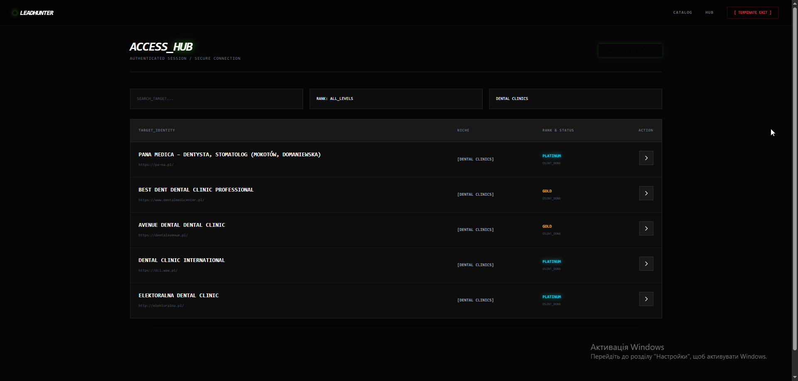
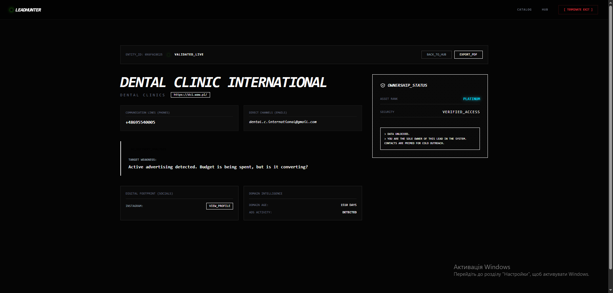
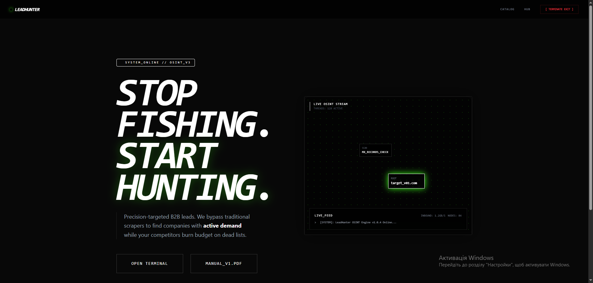
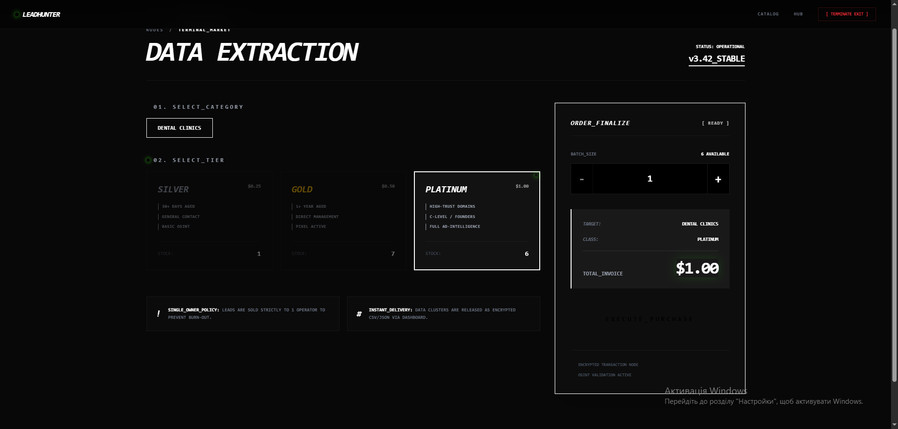

# 🔗 SHADOW-DATA-ENGINE
**High-performance microservice architecture for behavioral analytics, competitive intelligence, and automated data processing.**

[](https://leadhunteros.com)
[](https://leadhunteros.com)

---

### 📸 SYSTEM PREVIEW
> **Note:** Technical overview of the Behavioral Intelligence Layer in action.

| Dashboard Overview | Data Intelligence (Deep Dive) |
| :--- | :--- |
|  |  |

| Homepage Overview | Service Tiers |
| :--- | :--- |
|  |  |

---

### ⚙️ CORE FUNCTIONALITY
* **Multi-source Data Aggregation:** Automated collection of public business information and corporate infrastructure insights.
* **Data Enrichment:** Advanced verification of corporate contact points and social presence through cross-referencing public sources.
* **Market Intelligence Signals:** Monitoring digital activity patterns to determine business liquidity and market positioning.
* **Traffic Security Systems:** Management of residential proxies, browser fingerprints, and human-like behavioral emulation to ensure stable data flow.

---

### 🧠 PROJECT PHILOSOPHY

The project is built on the principles of **performance**, **discretion**, and **autonomy**.

* **Efficiency (Rust-first):** The system core, built on Rust (Axum/Tokio), ensures high-concurrency processing of thousands of requests with minimal memory overhead. Every millisecond of latency is minimized to maintain connection stability.
* **Source Agnosticism:** A modular microservice architecture allows for the integration of new data processing units without affecting the main orchestrator.
* **Stealth Engineering:** We focus on remaining invisible to security filters through deep management of browser fingerprints and dynamic proxy rotation.
* **Data Integrity (Zero Noise):** Primary focus on business intelligence enrichment. The system delivers refined business assets rather than raw, unverified data lists.

---

### 🏗️ ARCHITECTURE

```mermaid
graph TD
    %% Interface Layer
    subgraph Clients [Interface Layer]
        TG[Telegram Bot - Rust/Teloxide]
        Web[Web Dashboard - Next.js]
    end

    %% Orchestration Layer
    subgraph Core [Orchestration Layer - Rust]
        Gateway[API Gateway / Auth]
        Logic[Business Logic Engine]
    end

    %% Message Broker
    subgraph Transport [Message Broker]
        Redis[(Redis Cloud / Streams)]
    end

    %% Intelligence Layer
    subgraph Workers [Data Intelligence Layer]
        Scanner[Playwright Stealth Scanner]
        AdEngine[Market Signals Module]
        Parser[Python/Rust Data Scrubbers]
    end

    %% Data Layer
    subgraph Storage [Data Layer]
        Postgres[(PostgreSQL - Main DB)]
    end

    %% Relations
    TG & Web --> Gateway
    Gateway --> Logic
    Logic <--> Redis
    Redis <--> Workers
    Logic <--> Postgres
    Workers --> Postgres
